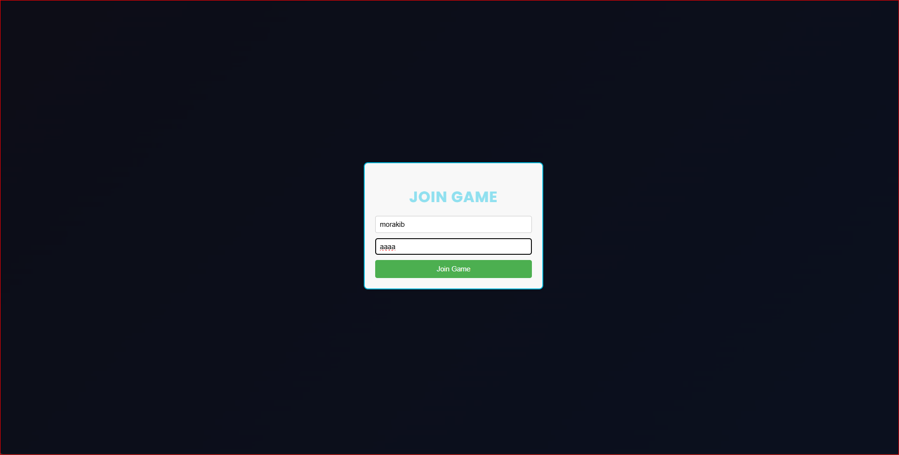
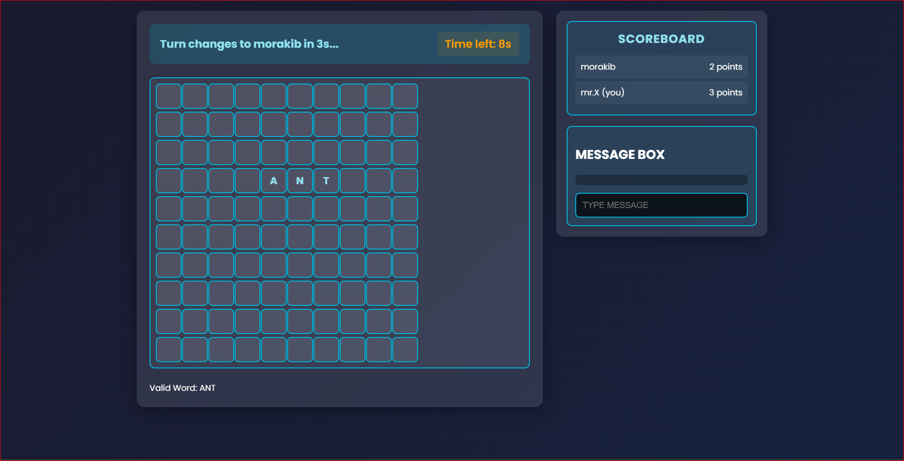
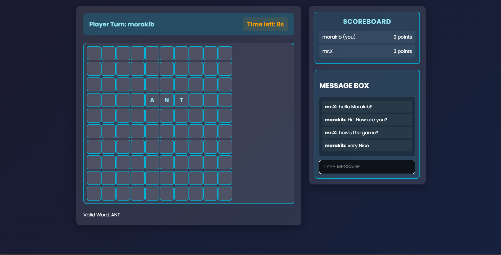

# 🧠 Multiplayer Word Making Game 🎮✨  

Who else loved playing word games as a kid? Let’s bring back the nostalgia with a fun twist!  
And no more **Skribbl**—this is something new! 🚀  

I've built a **multiplayer word-making game** where you can challenge friends and test your vocabulary skills! 🔥  

---

## 🔹 How It Works  

✅ **Place a valid English word** on the **10x10 grid**.  
✅ **Earn points** based on word length.  
✅ **Turn-based gameplay** – each player places **one word before the timer switches turns**.  
✅ **Live word validation** using an **online dictionary**.  
✅ **In-game chat** to talk with friends while playing!  

---
## Some ScreenShots
 
 
 

## 🚀 Recent Upgrades  

✔ **Words can only be placed in forward and downward directions.**  
✔ **Valid words appear below the grid after placement.**  
✔ **Smooth gameplay:** One player, one move per turn! (Waits **3 seconds** before switching turns.)  
✔ **Better UI:** Scrollable scoreboard & chat box.  
✔ **Players who leave are automatically removed from the scoreboard.**  

🌍 **Hosted on Render** for a seamless experience!  

> ⚠ **Note:** Since this runs on a **free instance**, the server **spins down with inactivity**.  
> This may cause a **50-second delay** when the first player joins after inactivity.  
> Once active, the game runs smoothly!  

---

## 🎮 Play Now  

🔗 **[Play Here](https://sword-a6b9.onrender.com)**  

💡 **Best Played On:**  
✅ **Laptop or PC browsers** *(Mobile chat function may not work properly)*  

---

## 💡 How to Join?  

1️⃣ Open the link in your browser.  
2️⃣ Enter your name & a **unique room ID**.  
3️⃣ Share the **room ID** with your friends and **start playing**!  

---  
⚠ **This is a Beta version.**  
You may experience some **lag or minor issues**—please be patient!  
**Suggestions are always welcome!**  
Your support is **badly needed!** 😃  

---

### 📢 Feedback & Contributions  

Have suggestions or found a bug?  
Feel free to **open an issue** or reach out!  

🔥 **Enjoy the game & happy word-making!** 🔤🎲  
